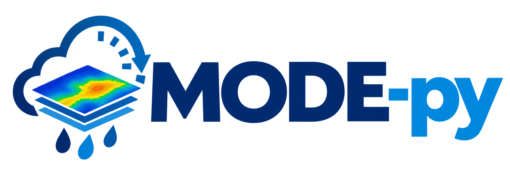

# MODE-py: Spatio-Temporal Object-Based Verification Framework

<p align="center">
  
</p>
 

---

[](https://www.python.org/downloads/)
[](https://opensource.org/licenses/MIT)
[] 

**MODE-py** is a modular, extensible, and reproducible Python framework for the spatio-temporal object-based verification of high-resolution precipitation forecasts. It implements the Method for Object-based Diagnostic Evaluation (MODE) with specific extensions to handle heterogeneous spatial resolutions (e.g., 3 km WRF vs. 10 km GPM IMERG) and temporal persistence analysis.

This repository contains the source code, synthetic benchmark suites, and documentation associated with the manuscript: 
*"MODE-py: A Python framework for spatiotemporal object-based verification of high resolution precipitation forecasts"* (Submitted to *Computers & Geosciences*).

## Key Features

*   **Adaptive Multi-Resolution Preprocessing:** Handles different grid resolutions and flexible temporal accumulation windows (1H, 3H, 6H).
*   **Spatio-Temporal Graph Grouping:** Transforms isolated 2D objects into persistent 3D entities using graph-based connectivity and trajectory tracking.
*   **Fuzzy Logic Matching:** Calculates a composite interest function (distance, area, overlap, orientation, temporal persistence) and resolves assignments via a greedy matching algorithm.
*   **Advanced Metrics:** Computes Median of Maximum Interest (MMI), classical Grid-Point Gilbert Skill Score (GSS), and Object-Based GSS.
*   **Integrated Sensitivity Analysis:** Automates parametric sweeps (convolution radii, thresholds) and generates diagnostic heatmaps.
*   **Synthetic Benchmark Suite:** Includes static (geometric perturbations) and dynamic (splitting, merging, translation) test cases for controlled algorithm validation.

## Requirements & Installation

MODE-py is developed in **Python 3.10+**. It is highly recommended to use a virtual environment.

```bash
# Clone the repository
git clone https://github.com/iamaleen/MODE-py.git
cd MODE-py

# Create and activate a virtual environment (optional but recommended)
### Using pip
python -m venv venv
source venv/bin/activate  # On Windows use: venv\Scripts\activate

# Install dependencies
pip install -r requirements.txt

### Using conda
conda env create -f environment.yml
conda activate mode-py
```
 
## Repository Structure

MODE_Verification/

    |-- config.py                  # Centralized configuration (paths, parameters, weights)

    |-- data_loader_.py            # Ingestion of GPM (HDF5) and WRF (NetCDF) data

    |-- preprocessor_.py           # Temporal alignment and spatial cropping

    |-- mode_verifier.py           # Core algorithmic implementation (MODE3DVerifier class)

    |-- field_visualization.py     # Geospatial plotting utilities (Cartopy/Matplotlib)

    |-- statistical_analysis.py    # Quartile analysis and temporal persistence diagnostics

    |-- sensitivity_analysis.py    # Parametric sweeps and heatmap generation

    |-- run_mode_verification.py   # Main execution pipeline

        synthetic_benchmark/
            |-- synthetic_generator.py     # Generation of controlled geometric/temporal perturbations

            |-- synthetic_visualization.py # Plotting tools for synthetic cases

            |-- run_synthetic_benchmark.py # Execution script for the benchmark suite


## Data Sources and Input Formats

MODE-py was originally designed, tested, and validated using the following high-resolution datasets:

*   **Observations:** Global Precipitation Measurement (GPM) IMERG V07 Half-Hourly (30-min) satellite estimates. You can download the official HDF5 files from the [NASA GES DISC portal](https://disc.gsfc.nasa.gov/datasets/GPM_3IMERGHH_07/summary).
*   **Forecasts:** Weather Research and Forecasting (WRF) model outputs (NetCDF format), specifically utilizing the `RAINNC` (grid-scale) and `RAINC` (cumulus) variables to compute total accumulated precipitation.

### Using Custom Data Sources
While MODE-py is optimized for WRF and GPM, its modular architecture allows you to adapt it to other Numerical Weather Prediction (NWP) models or observational datasets (e.g., ground-based radar, other satellite products). 

If you wish to use your own custom data, please ensure your files adhere to the following structural requirements. *(Note: These are the exact dimensions and formats generated by our built-in `synthetic_generator.py` for dummy data testing)*:

1.  **File Format:** NetCDF (`.nc`) is the standard and recommended format for both forecast and observation inputs.
2.  **Dimensions:** The precipitation data array must strictly contain three dimensions: `(time, lat, lon)`.
3.  **Coordinates:**
    *   `time`: A 1D array of timestamps (e.g., `pandas.DatetimeIndex` or `numpy.datetime64`).
    *   `lat`: A 1D array of latitude values (in decimal degrees).
    *   `lon`: A 1D array of longitude values (in decimal degrees).
4.  **Variables:** The dataset must include a precipitation variable (e.g., named `precipitation` in mm/h, or `RAINNC`/`RAINC` in mm for WRF).

* **Tip for Custom Observations:** The default `data_loader_.py` uses `h5py` to read the native GPM HDF5 files. If you want to use custom observational data in NetCDF format, you can easily adapt the `load_gpm_data()` function in `data_loader_.py` to use `xarray.open_dataset()` instead, exactly as it is done for the WRF forecasts.*


 
## Running MODE-py

MODE-py is executed through the `run_mode_verification.py` driver script. The main verification workflow uses the configuration defined in `config.py`, which contains the input/output paths, precipitation thresholds, convolution radii, minimum object sizes, temporal accumulation settings, merging distances, and interest-function parameters.

### 1. Prepare the input data

MODE-py was developed and tested primarily with:

* **GPM IMERG V07/V07B** precipitation observations in HDF5 format, with 30-minute temporal resolution.
* **WRF** model output in NetCDF format.

For WRF precipitation, the framework uses the `RAINNC` and `RAINC` variables to obtain total accumulated precipitation.

Place the input datasets in the locations specified in `config.py`.

### 2. Configure the experiment

Before running the verification, edit `config.py` and specify the input/output paths and the parameters required for the experiment.
 
Additional configuration options control temporal accumulation, spatial object merging, interest-function weights, and output directories.

> **Important:** `config.py` is the central configuration file. No modification of the core `MODE3DVerifier` implementation is required for a standard verification experiment.

### 3. Run the complete verification

From the repository root, execute:

```bash
python run_mode_verification.py
```

The script calls the `MODE3DVerifier` class implemented in `mode_verifier.py` and executes the complete MODE-py verification workflow, including:

1. data loading;
2. temporal alignment and accumulation;
3. spatial preprocessing;
4. precipitation thresholding;
5. object identification;
6. object characterization;
7. spatial and temporal object grouping;
8. interest-function calculation;
9. object matching;
10. verification metric calculation; and
11. diagnostic visualization and output generation.

Depending on the configured experiment, the workflow generates CSV files, PNG figures, and serialized intermediate results that can be used for subsequent analysis without repeating the complete verification.

### 4. Run sensitivity analysis

MODE-py also provides an integrated sensitivity-analysis workflow for exploring the influence of key parameters such as precipitation threshold, convolution radii, and minimum object size.

To run the sensitivity analysis together with the verification workflow:

```bash
python run_mode_verification.py --sensitivity
```

To execute only the sensitivity-analysis stage:

```bash
python run_mode_verification.py --sensitivity-only
```

The sensitivity workflow evaluates combinations of the selected parameters and produces diagnostic matrices/heatmaps and CSV files containing the corresponding verification metrics.

### 5. Inspect the outputs

The generated outputs include, depending on the selected workflow:

* verification metrics such as MMI, classical GSS, and Object-Based GSS;
* identified forecast and observed objects;
* matched object pairs;
* diagnostic spatial figures;
* sensitivity-analysis heatmaps;
* CSV files containing numerical results; and
* serialized intermediate objects for subsequent analysis.

The exact output locations are controlled through `config.py`.

---

## Running the Synthetic Benchmark Suite

MODE-py includes a dedicated synthetic benchmark environment for controlled validation of the object-identification, matching, and verification procedures.

The benchmark suite contains two complementary groups:

* **Static Benchmark Suite:** controlled geometric perturbations such as displacement, orientation differences, fragmentation, elongated convective structures, and multicore systems.
* **Dynamic Benchmark Suite:** time-evolving scenarios including translation, convective splitting, and convective merging.

The benchmark datasets are generated in NetCDF format and can be processed using the same MODE-py verification framework.

From the repository root:

```bash
cd synthetic_benchmark
python run_synthetic_benchmark.py
```

The benchmark workflow generates the synthetic datasets, executes the verification procedures, and produces the corresponding diagnostic outputs.

The synthetic benchmark environment is independent from the real-data workflow and is intended primarily for controlled algorithm validation and reproducibility testing.


